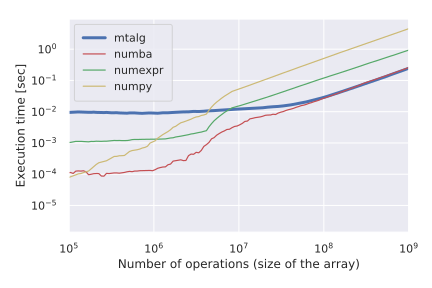
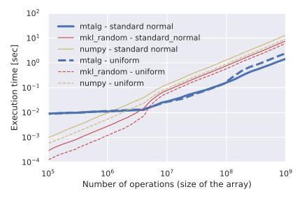

#  *mtalg* — Multithreaded Algebra 

[](#)

# About

***mtalg*** is a package for multithreaded algebra and random number generation.

While numpy does support out of the box multithreaded linear algebra 
([numpy.linalg](https://numpy.org/doc/stable/reference/routines.linalg.html)) 
for operations such as matrix multiplication, decomposition, spectral analysis, 
and related functions, which are building on libraries such as BLAS and LAPACK, 
the same does not hold true for simpler algebraic element-wise operations. 
Similarly can be said for the generation of random variates.

***mtalg*** is the fastest library known to us for large scale element-wise algebraic operations 
and random number generation. For more info on benchmarks you can see the dedicated section below. 

Major benefits become apparent past $`10^7`$ operations for the element-wise algebra module, 
and for more than XX operations for the random number generator module.

# Installation

You can simply install from the ECB artifactory via pip as:

`pip install ecb-mtalg`

# How to use
###### Import random number generator and algebra functions
```python
from mtalg.random import MultithreadedRNG
from mtalg.alg import (add_MultiThreaded as addMT,
                       sub_MultiThreaded as subMT,
                       mul_MultiThreaded as mulMT,
                       div_MultiThreaded as divMT,
                       pow_MultiThreaded as powMT)
```
###### Create an instance of the multithreaded random number generator with seed for reproducability and number of threads to be used
```python
mrng = MultithreadedRNG(seed=1, num_threads=4)
```
###### Create two arrays (results are stored in `mrng.values`)
```python
mrng.standard_normal(size=(100, 50))
A = mrng.values
mrng.uniform(size=(100, 50), low=0, high=10)
B = mrng.values
```
###### Add B to A (A is modified inplace)
```python
addMT(A, B)
```
###### Subtract A from B (B is modified inplace)
```python
subMT(A, B, direction='right')
```
###### Multiply, divide and raise to power (A is modified inplace)
```python
mulMT(A, B)
divMT(A, B)
powMT(A, B)
```

# Benchmarks

### Elementwise algebra





### Random number generation





# Aknowledgments

The module for multithreaded generation of random numbers is inspired from [here](https://numpy.org/doc/stable/reference/random/multithreading.html).  

# Authors
[Wouter Wakker](https://gitlab.sofa.dev/Wouter.Wakker) 
and [Luca Mingarelli](https://gitlab.sofa.dev/Luca.Mingarelli), 
2021

[](#)
